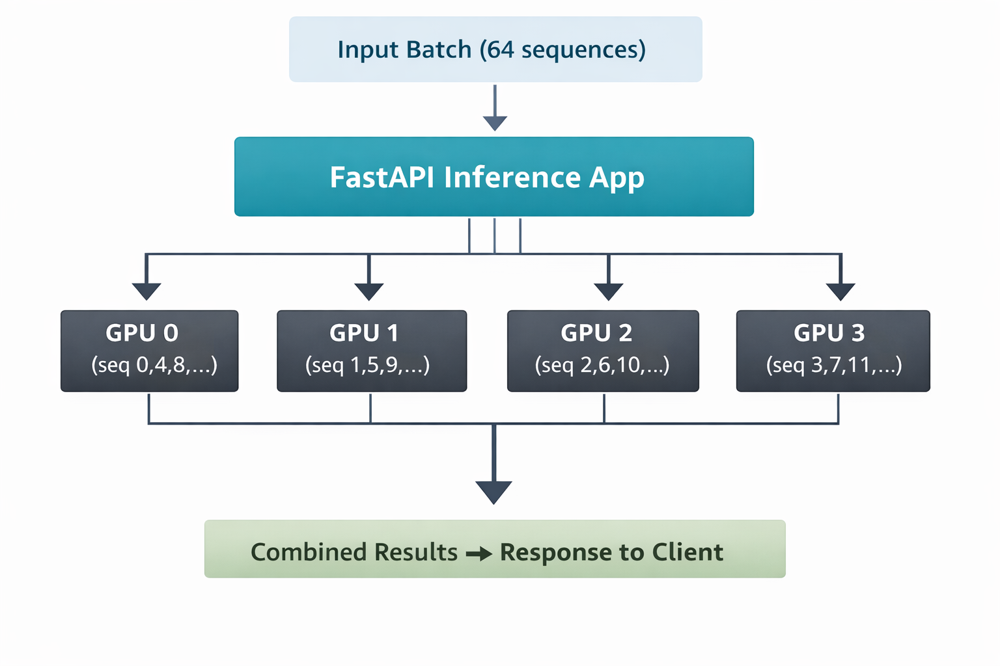

# ESM2 Multi-GPU Inference Service

---

## Overview

Production-ready **FastAPI** inference service for:

`facebook/esm2_t33_650M_UR50D`

This project demonstrates a scalable **multi-GPU architecture** capable of:

- Automatically detecting **0, 1, 4, or 8 GPUs**
- Loading one model replica per device
- Distributing batch inference requests in parallel
- Falling back to CPU if CUDA is unavailable

All GPU behavior is fully testable via mocking.

Designed for real multi-GPU production environments such as:

- AWS g5.48xlarge  
- AWS p4d.24xlarge  

---

## System Architecture

### High-Level Overview

```text
Client (Batch ≤ 64 sequences)
            │
            ▼
        FastAPI
            │
            ▼
     ESM2Inference Engine
            │
            ├── cuda:0 → Model Replica 0
            ├── cuda:1 → Model Replica 1
            ├── cuda:2 → Model Replica 2
            ├── cuda:3 → Model Replica 3
            ├── cuda:4 → Model Replica 4
            ├── cuda:5 → Model Replica 5
            ├── cuda:6 → Model Replica 6
            └── cuda:7 → Model Replica 7
```

Each GPU hosts an independent model replica.

Incoming batches are distributed **round-robin across devices** and executed in parallel.

---

## GPU Distribution Strategy

### Design Principles

- One model replica per GPU  
- No cross-GPU synchronization  
- Round-robin batch distribution  
- Parallel execution using `ThreadPoolExecutor`  
- Automatic CPU fallback  

This avoids synchronization overhead from `DataParallel` and enables horizontal scaling.

---

## Multi-GPU Batch Distribution Architecture

The inference service distributes incoming batches across available GPUs
using a round-robin strategy to balance computational load.




## Multi-GPU Batch Distribution Logic (Pseudocode)

```python
num_devices = torch.cuda.device_count()

if num_devices == 0:
    devices = ["cpu"]
else:
    devices = [f"cuda:{i}" for i in range(num_devices)]

models = {
    device: load_model().to(device)
    for device in devices
}

def predict_batch(sequences):
    chunks = [[] for _ in devices]

    for i, seq in enumerate(sequences):
        chunks[i % len(devices)].append(seq)

    with ThreadPoolExecutor(max_workers=len(devices)) as executor:
        futures = []
        for device, chunk in zip(devices, chunks):
            if chunk:
                futures.append(
                    executor.submit(run_inference, device, chunk)
                )

        results = []
        for f in futures:
            results.extend(f.result())

    return results
```

---

## API Endpoints

### `GET /health`

Returns:

```json
{
  "status": "ok",
  "physical_cuda_available": true,
  "logical_devices": 8,
  "devices": ["cuda:0", "...", "cuda:7"]
}
```

Returns **503** while models are loading.

---

### `POST /predict`

Single sequence inference.

---

### `POST /predict/batch`

Batch inference (maximum 64 sequences).

Input validation ensures production safety.

---

## Performance Characteristics

Benchmarks were performed on a CPU-only machine with mocked GPU counts.

### Benchmark Results (Simulation)

| Simulated GPUs | Throughput (seq/sec) |
|----------------|----------------------|
| 1              | 51.52                |
| 2              | 60.53                |
| 4              | 62.41                |
| 8              | 55.17                |

### Analysis

Scaling improves from **1 → 4 simulated GPUs** but plateaus beyond that due to:

- CPU saturation  
- Python threading overhead  
- Tokenization cost  
- Context switching overhead  

Since all replicas share CPU resources in simulation, diminishing returns are expected.

---

## Expected Real Multi-GPU Scaling

On actual multi-GPU hardware:

- Each replica runs on independent CUDA devices  
- CUDA kernels release the GIL  
- Minimal CPU contention  
- No cross-GPU synchronization  

### Projected Relative Throughput

| GPUs | Expected Scaling |
|------|-----------------|
| 1    | 1x              |
| 2    | ~1.9x           |
| 4    | ~3.7x           |
| 8    | ~7x             |

Performance limits include:

- PCIe bandwidth  
- Host memory bandwidth  
- Kernel launch overhead  

---

## Production Readiness

This repository includes:

- FastAPI service  
- Multi-GPU inference engine  
- Unit tests with mocked GPU counts  
- Benchmark script  
- Dockerfile (CUDA runtime base)  
- Kubernetes manifests  
- CI pipeline  
- Namespace isolation  
- ResourceQuota  
- PodDisruptionBudget  
- Startup, readiness, and liveness probes  
- Shared memory mount (`/dev/shm`)  

The system is directly deployable to GPU-enabled Kubernetes clusters.

---

## Kubernetes Deployment Strategy

Designed for:

- AWS g5.48xlarge (8× A10G GPUs)  
- AWS p4d.24xlarge (8× A100 GPUs)  

### GPU Configuration

```yaml
resources:
  requests:
    nvidia.com/gpu: 8
  limits:
    nvidia.com/gpu: 8
```

Includes:

- `runtimeClassName: nvidia`  
- GPU tolerations  
- Shared memory for PyTorch  
- Health probes for model loading  

---

## Deployment Order

Apply Kubernetes resources in this order:

```bash
kubectl apply -f k8s/namespace.yaml
kubectl apply -f k8s/resourcequota.yaml
kubectl apply -f k8s/deployment.yaml
kubectl apply -f k8s/service.yaml
kubectl apply -f k8s/pdb.yaml
```

This ensures:

1. Namespace exists  
2. Resource quotas are enforced  
3. Deployment creates pods  
4. Service exposes the deployment  
5. PodDisruptionBudget protects availability  

---

## Testing Strategy

GPU behavior is mocked via:

```python
@patch("torch.cuda.device_count", return_value=8)
@patch("torch.cuda.is_available", return_value=True)
```

Tests verify:

- Correct device detection  
- Proper batch splitting  
- Error handling  
- Health endpoint behavior  

---

## Design Tradeoffs

### Why model replicas instead of DataParallel?

- Avoids synchronization overhead  
- Better horizontal scaling  
- Cleaner fault isolation  
- Simpler mental model  

### Why ThreadPoolExecutor?

- CUDA operations release the GIL  
- Lower IPC overhead than multiprocessing  
- Simpler memory management  

---

## Future Improvements

### Performance

- Async request batching  
- Dynamic micro-batching  
- TorchScript / `torch.compile`  
- Mixed precision inference  
- Triton Inference Server integration  

### Observability

- Prometheus metrics  
- Request latency histograms  
- GPU utilization metrics  

### Scalability

- Horizontal Pod Autoscaling  
- Queue-based backpressure  
- Distributed inference coordination  

### Reliability

- Circuit breaker  
- Rate limiting  
- Retry logic  
- Model warmup endpoint  

---

## Repository Structure

```text
.
├── app.py
├── inference.py
├── benchmark.py
├── requirements.txt
├── Dockerfile
├── tests/
│   └── test_inference.py
├── k8s/
│   ├── namespace.yaml
│   ├── deployment.yaml
│   ├── service.yaml
│   ├── pdb.yaml
│   └── resourcequota.yaml
└── .github/workflows/ci.yml

```

---