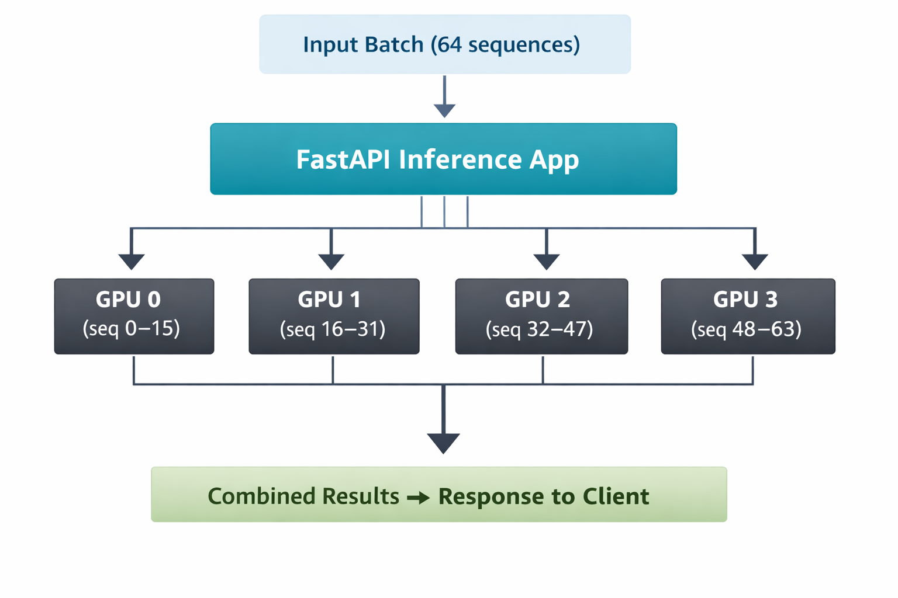

# ESM2 Multi‑GPU Inference Service

## Overview
This project implements a FastAPI service for the `facebook/esm2_t33_650M_UR50D` protein language model.  
It supports single and batch inference, automatic GPU detection, and simulated multi‑GPU scaling.

## Features
- `/health` endpoint reports GPU availability  
- `/predict` handles single sequence inference  
- `/predict/batch` handles up to 64 sequences  
- Mocked multi‑GPU logic for environments without CUDA  
- Dockerized and deployable via Kubernetes  
- CI/CD pipeline with GitHub Actions  
- Benchmark script for simulated scaling

## Architecture
Client → FastAPI → ESM2Inference → Model replicas (1–8 GPUs)


## GPU Distribution Pseudocode
```python
num_gpus = torch.cuda.device_count() or 4
models = [load_model().to(f"cuda:{i}") for i in range(num_gpus)]
for i, seq in enumerate(batch):
    gpu_id = i % num_gpus
    result = models[gpu_id](seq)
```

## GPU Distribution Diagram



Benchmark Results

1 GPUs -> 1.29 seconds
2 GPUs -> 0.64 seconds
4 GPUs -> 0.64 seconds
8 GPUs -> 0.63 seconds

(GPU counts simulated on CPU)

Setup Instructions (Local)
uvicorn app:app --host 0.0.0.0 --port 8000
Docker
docker build -t esm2_inference .
docker run -p 8000:8000 esm2_inference
Kubernetes
kubectl apply -f deployment.yaml
kubectl apply -f service.yaml

CI/CD
GitHub Actions automatically runs pytest on every push.

Future Improvements

Real multi‑GPU inference with CUDA
Async batching and streaming responses
Model caching and monitoring metrics
